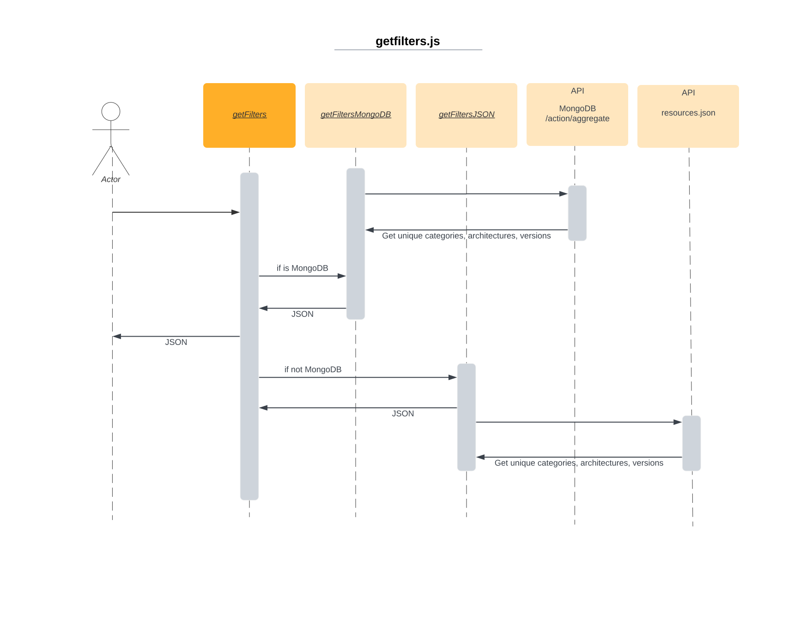

# API Documentation for Static Website

This is a collection of 4 JavaScript files that function as the API for resource management. The API provides functions for searching, filtering, and fetching resources from a database. The implementation of the database can be either MongoDB or JSON, depending on the value of the `process.env.IS_MONGODB_ENABLED` environment variable.

## Files

The API is composed of the following files:

- `findresources.js`: This file contains a wrapper function that invokes the `getResources` function for either MongoDB or JSON, depending on the value of`process.env.IS_MONGODB_ENABLED`. The `getResources` function is used for searching resources based on a query.

- `getfilters.js`: This file contains a wrapper function that invokes the `getFilters` function for either MongoDB or JSON, depending on the value of `process.env.IS_MONGODB_ENABLED`. The `getFilters` function is used for fetching the filtering options present on the website dynamically.

- `getresource.js`: This file contains a wrapper function that invokes the `getResources` function for either MongoDB or JSON, depending on the value of `process.env.IS_MONGODB_ENABLED`. The `getResources` function is used for finding a resource by its exact ID.

- `resources.js`: This file contains a wrapper function that invokes the `fetchResources` function for either MongoDB or JSON, depending on the value of `process.env.IS_MONGODB_ENABLED`. The `fetchResources` function is used for fetching the entire database of resources.

## Functions

<dl>
<dt><a href="#getResources">getResources(queryObject, filters)</a> ⇒ <code>json</code></dt>
<dd>
Wrapper function to fetch the resources based on the query object.

</dd>
<dt><a href="#getFilters">getFilters()</a> ⇒ <code>json</code></dt>
<dd>
Gets the filters from the database.

</dd>
<dt><a href="#getResource">getResource(id)</a> ⇒ <code>json</code></dt>
<dd>
Fetches a resource from the MongoDB database or JSON file.

</dd>
<dt><a href="#fetchResources">fetchResources()</a> ⇒ <code>Promise</code></dt>
<dd>
Fetches resources either from a MongoDB database or from a JSON file based on the value of the IS_MONGODB_ENABLED environment variable.

</dd>
</dl>

## getResources(queryObject, currentPage, pageSize) ⇒ <code>json</code>

Wrapper function to fetch the resources based on the query object.

**Kind**: global function  
**Returns**: <code>json</code> - The resources in JSON format. 

| Param | Type | Description |
| --- | --- | --- |
| queryObject | <code>json</code> | The query object. |
| filters | <code>json</code> | The filters to be applied. |

## getFilters() ⇒ <code>json</code>

Gets the filters from the database.

**Kind**: global function  
**Returns**: <code>json</code> - A json object with the filters.  

## getResource(id) ⇒ <code>json</code>

Fetches a resource from the MongoDB database or JSON file.

**Kind**: global function  
**Returns**: <code>json</code> - The resource in JSON format.  

| Param | Type | Description |
| --- | --- | --- |
| id | <code>string</code> | The id of the resource to be fetched. |

## fetchResources() ⇒ `json`

Fetches resources either from a MongoDB database or from a JSON file based on the value of the IS_MONGODB_ENABLED environment variable.

**Kind**: global function  
**Returns**: <code>json</code> - A JSON object containing all the resources.  
